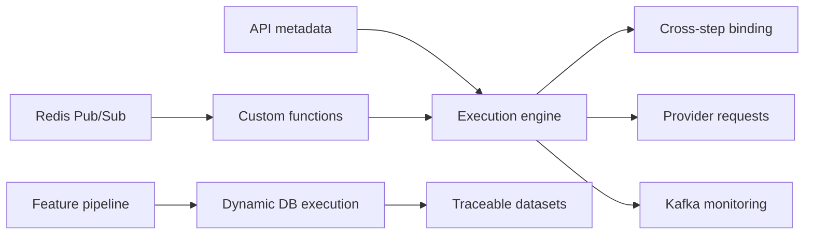

<div align="center">


[](mailto:pangvito150@gmail.com)
[](https://github.com/vito150)
[](https://learn.microsoft.com/en-us/credentials/certifications/azure-developer/)


</div>

## Hi, I am Vito

I am a software engineer with 1.5 years of experience building integration platforms that support machine learning workflows. I like finding the real problem behind requirements, then turning repeated business processes into configurable, observable platform capabilities.

My recent work has been around **API integration**, **dynamic execution engines**, **feature/data preparation workflows**, and **full-stack product delivery**.

## What I Work With

<div align="center">


</div>

## Featured Work

### Variable Management Platform

Professional fintech platform work at **VCredit**, focused on configurable API onboarding and ML feature preparation workflows.

| Area | What I built |
| --- | --- |
| Configurable API model | Represented HTTP requests as metadata so provider-specific API onboarding could be handled through configuration instead of repeated code changes. |
| Multi-step execution engine | Supported cross-step data binding, historical-result reuse, runtime custom functions, and Kafka-based execution monitoring. |
| Runtime consistency | Used Redis Pub/Sub to propagate custom function updates across distributed service instances. |
| Feature management | Built data preparation workflows for dynamic table creation, data synchronization, sample-feature mapping, result traceability, and async feature computation. |
| Dynamic database execution | Decoupled business-driven SQL generation from data source routing, connection pooling, and query execution. |



### Social Activity Platform

A full-stack social activity app covering event creation, attendance, profiles, following, comments, maps, photo upload, and real-time interactions.

[](https://github.com/vito150/socialApplication)
[](https://socialapp-encyg9fgbtfadtdg.southeastasia-01.azurewebsites.net/)

Built with **ASP.NET Core**, **Entity Framework Core**, **SQL Server**, **React**, **TypeScript**, **React Query**, **SignalR**, **Cloudinary**, and **Azure App Service**.

### Interview Playbook

A Markdown-first interview knowledge base for resume bullets, backend review, system design, English interview answers, STAR stories, mock interviews, and weekly reviews.

[](https://github.com/vito150/InterviewPlaybook)

## How I Think About Engineering

```text
Find the actual problem.
Turn repeatable work into a platform capability.
Make execution observable.
Keep the system understandable enough to change later.
```

## Current Focus

- System design for backend and platform interviews
- Cleaner English storytelling for technical and behavioral interviews
- Azure development and deployment practice
- Turning project experience into reusable engineering playbooks

## GitHub Pulse

<div align="center">


</div>

<picture>
  <source media="(prefers-color-scheme: dark)" srcset="https://raw.githubusercontent.com/vito150/vito150/output/github-contribution-grid-snake-dark.svg">
  <source media="(prefers-color-scheme: light)" srcset="https://raw.githubusercontent.com/vito150/vito150/output/github-contribution-grid-snake.svg">
  
</picture>

<div align="center">


</div>
